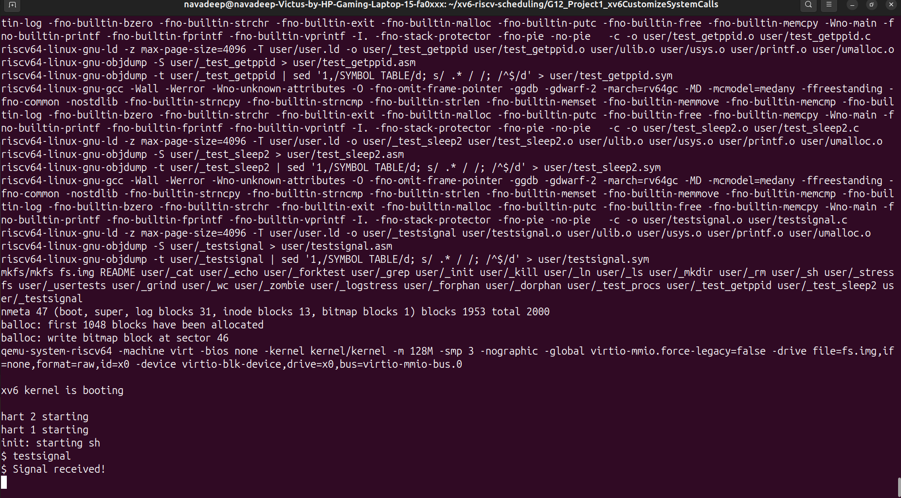

# Signal System Call Implementation in xv6

## Objective

To implement a basic signal handling mechanism in xv6.

---

## Description

In this project, a custom system call `signal()` is implemented.
The `kkill()` function is modified to trigger a signal instead of terminating the process.

The scheduler is updated to detect pending signals and execute corresponding actions.

---

## Files Modified

* kernel/proc.h
* kernel/proc.c
* kernel/sysproc.c
* kernel/syscall.c
* kernel/syscall.h
* user/usys.pl
* user/user.h

---

## How to Run

Inside xv6:

```bash
testsignal
```

---

## Output



---

## Conclusion

The signal system call was successfully implemented and tested using a user program.
